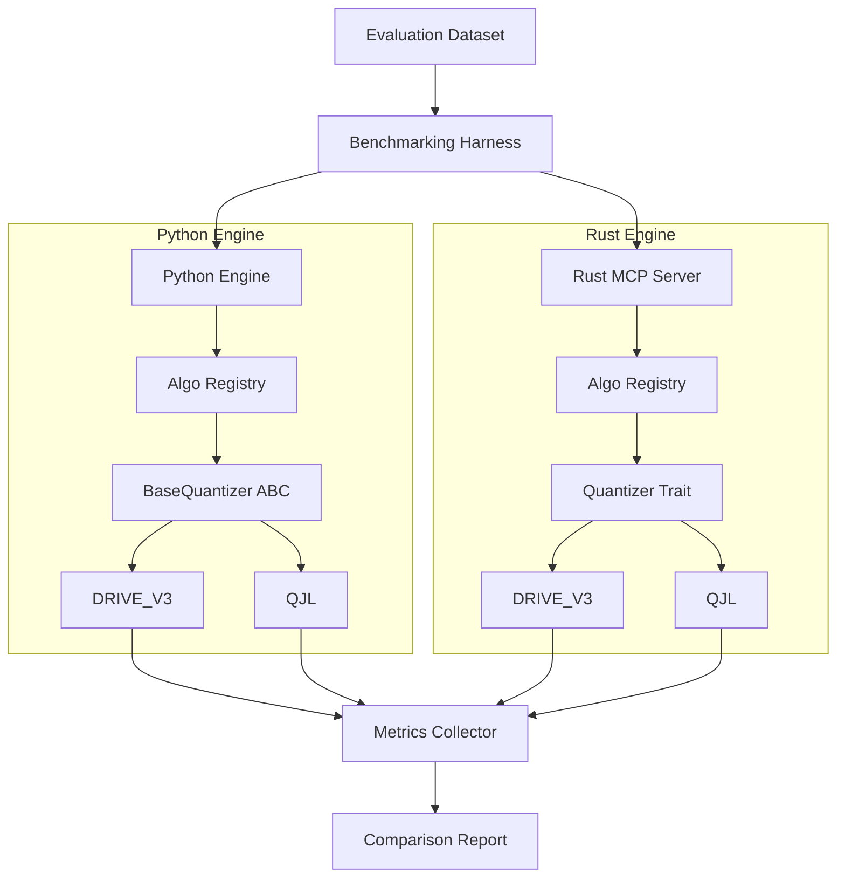

# 아키텍처 설계: 알고리즘 비교 프레임워크

본 문서는 양자화 알고리즘의 체계적인 추가와 비교를 위한 기술적 설계를 정의한다.

## 1. 전체 아키텍처 다이어그램 (High-Level)



## 2. 상세 설계

### 2.1 플러그형 인터페이스 설계

#### Python (`BaseQuantizer` ABC)
```python
class BaseQuantizer(ABC):
    @abstractmethod
    def quantize(self, x: np.ndarray) -> QuantizedResult:
        """벡터 x를 양자화하여 q와 r을 반환"""
        pass

    @abstractmethod
    def decode(self, q: QuantizedResult) -> np.ndarray:
        """양자화된 값 q로부터 벡터 x_hat을 복원"""
        pass

    @abstractmethod
    def calculate_score(self, query: np.ndarray, q: QuantizedResult) -> float:
        """쿼리와 양자화된 값 사이의 보정된 내적 점수 계산"""
        pass
```

#### Rust (`Quantizer` Trait)
```rust
trait Quantizer {
    fn quantize(&self, x: &[f32]) -> QuantizedResult;
    fn decode(&self, q: &QuantizedResult) -> Vec<f32>;
    fn score(&self, query: &[f32], q: &QuantizedResult) -> f32;
}
```

### 2.2 벤치마크 시퀀스 (Sequence Flow)

1. **초기화**: `BenchmarkingHarness`가 설정 파일을 읽어 테스트할 알고리즘 목록을 로드한다.
2. **데이터 로드**: 표준 평가 데이터셋을 메모리에 올리고 $\ell_2$-normalization을 수행한다.
3. **반복 측정 (per Algorithm)**:
   - **양자화**: `quantize()` 호출 $\rightarrow$ 메모리 사용량 및 시간 측정.
   - **복원**: `decode()` 호출 $\rightarrow$ vNMSE 계산.
   - **검색**: `calculate_score()` 호출 $\rightarrow$ Recall@K 및 Latency 측정.
4. **결과 집계**: 모든 알고리즘의 지표를 `MetricsCollector`에 저장한다.
5. **리포트 생성**: JSON/Markdown 형식으로 비교표를 출력한다.

## 3. 기술적 의사결정 및 트레이드오프

- **왜 ABC/Trait를 사용하는가?**: 새로운 알고리즘 추가 시 코어 엔진(`MemoryEngine`)의 코드를 수정하지 않고 클래스 추가만으로 기능을 확장하기 위함이다.
- **교차 언어 검증 방식**: 동일한 시드(Seed)로 생성된 $R$ 행렬을 공유하고, 동일한 입력 벡터에 대해 Python과 Rust의 `QuantizedResult`가 비트 단위로 일치하는지 확인하여 포팅 무결성을 보장한다.
- **측정 정밀도**: Python의 경우 `time.perf_counter_ns`를, Rust의 경우 `Instant`를 사용하여 나노초 단위의 정밀도를 확보한다.
